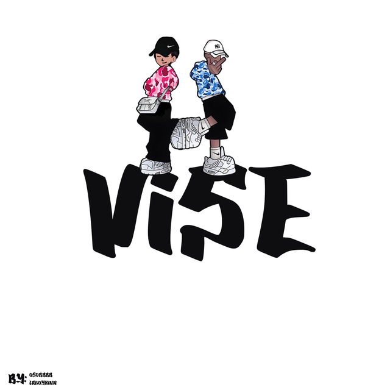

# VISE SHOP
[](https://git.io/typing-svg)
<h3>Сайт с любимыми всеми кроссовками из детсва</h3>



Репозиторий
В данном репозитории находится Frontend, а также Backend часть проекта.

# Особенности
  - Возможность подтверждения аккаунта ссылке в почте;
  - Плавная анимация перехода между страницами;
  - Приятный для глаза дизайн сайта;

# Установка и запуск
  1. Скачать проект в формате .zip и распаковать или с помощью команды:
```git clone https://github.com/Luckerhns/shoes__website```
  2. Установить npm пакеты:
```npm i или yarn```
  3. Запустить проект с помощью локального сервера (MAMP или Open Server).
  4. Запустить Server:
```npm run dev или yarn run dev```
  5. Запустить Client:
```npm start или yarn start```


# Документация
Пользовательскую документацию можно получить [здесь](https://github.com/xworu/regames/wiki).

# Участники проекта
  - [UX/UI-дизайнер, Frontend-разработчик](https://github.com/Lizokkkkk)
  - [Frontend-разработчик игры "Тетрис"](https://github.com/xworu)
  - [Frontend-разработчик игры "Змейка"](https://github.com/komsh1l)
